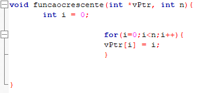
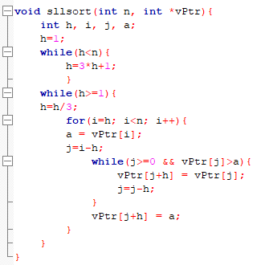

**UNIVERSIDADE FEDERAL DE MATO GROSSO**

**ALGORITMOS E ESTRUTURA DE DADOS II**

**Alunos: EDUARDO OLIVEIRA SILVA e MATHEO RODRIGUES BONUCIA**

**CUIABÁ - MT**

**2021**

**ALGORITMOS DE ORDENAÇÃO**

Trabalho apresentado a disciplina de Algoritmos e Estrutura de Dados II da Universidade Federal de Mato Grosso, para o aprendizado dos discentes e obtenção da nota de conclusão.

Professor (a): Frederico Santos de Oliveira

1. **INTRODUÇÃO**

O projeto avaliativo dois, consiste na criação de um algoritmo que possa desfrutar da ordenação de n elementos de um vetor de oito formas diferentes, sendo cada uma delas recomendadas para certo número de inteiros dentro de um vetor. Ademais, as oito formas diferentes são: *bubblesort, insertionsort, selectionsort, shellsort, mergesort, heapsort, quicksort e countingsort.* Assim sendo, respectivamente, as três primeiras formas são indicadas para uma ordenação com baixo número de elementos devido a sua estrutura ser mais simples, entretanto, as restantes, exceto *countingsort,* são responsáveis por terem uma estrutura mais elaborada, possibilitando assim a ordenação de n elementos em quantidades maiores que em relação as três primeiras formas, destacando também, a forma *quicksort* que quando bem estruturada possui uma velocidade de processamento superior as demais. Também, o projeto conta com um algoritmo extra de ordenação, sendo justamente o *countingsort*, que foi escolhido devido a sua possibilidade de processamento extremamente rápido com uma baixa quantidade de números inteiros.

De modo geral, o algoritmo foi estruturado em oito bibliotecas, onde cada uma abriga a função referente a forma de ordenação respectiva e possui o arquivo *main* que é constituído de quatro bibliotecas, “stdio.h”, “stdlib.h”, “time.h” e “math.h”, bem como as oito bibliotecas de ordenação e outra responsável por realizar a contagem de movimentações e comparações nas formas *bubblesort, insertionsort e selectionsort*, denominada “analisedetempo.h”. Por fim, cada uma das funções e bibliotecas que formam o algoritmo completa serão descritas e explicadas ao desenvolver do projeto.

1. **DESENVOLVIMENTO**

O projeto parte do princípio em utilizar a criação de “arquivos .h”, ou seja, bibliotecas que nelas possam ser armazenadas as funções que correspondem ao algoritmo da forma de ordenação correspondente, a exemplo o *bubblesort,* como demonstrado logo abaixo (figura 1) em que é possível visualizar o algoritmo da ordenação *(bubblesort)* abrigado em uma biblioteca que será posteriormente chamada na função principal *main*.

Figura 1

Como o principal propósito do projeto seja apresentar as diferentes formas de ordenação, este método demonstrado acima, possibilita ao programador uma organização melhor do código, assim como a utilização dessas funções em outros códigos de maneira mais rápida e prática. Portanto, todas as oito formas de ordenação e a função responsável pela análise da movimentação e comparação das três primeiras formas mais simples (como citado anteriormente), são inseridas ao projeto da mesma forma, como abaixo:

Figura 2

Ademais, são criadas as quatro funções responsáveis por gerarem e exibirem o vetor de n elementos, sendo elas: “funcaorandom”, “funcaocrescente”, “funcaodecrescente” e “printvetor”. Todas as funções são do tipo *void* e são, respectivamente, responsáveis pela criação de n elementos de forma aleatória, de forma crescente e decrescente, por exemplo, caso o usuário informe que queira a criação de 5000 elementos na forma crescente, a função irá gerar elementos de 0 a 4999 (0, 1, 2, ..., 4999), bem como a última função irá ser responsável por exibir estes inteiros gerados na tela do usuário.

Partindo ao esqueleto do código, o *main* será responsável por pedir para o usuário informar qual o tipo de ordem que ele deseja para a execução da ordenação (aleatório, crescente ou decrescente), após isso será solicitado qual o tamanho desejado do vetor (quantidade n de elementos) e será reservado um espaço para o ponteiro “vPtr” com o *malloc*. A partir deste ponto, o código será dividido em três partes extensas, sendo elas as ordens 1, 2 e 3, onde a ordem 1 irá significar quando o vetor é gerado por inteiros aleatórios de 0 a 9, a ordem 2 será crescente (0, 1, 2, ..., n) e a ordem 3 decrescente (n-1, n-2, ..., 0), assim sendo, cada parte extensa desta irá abrigar em sua composição uma função *if* que será responsável por indicar qual formato de ordenação deverá ser chamado (aquele escolhido pelo usuário), *bubblesort, selectionsort, etc.* Quando chamado o formato escolhido, o algoritmo irá calcular o tempo de processamento deste formato a partir da função *clock(),* que se encontra na biblioteca “temp.h” e será printado o resultado após gerar na tela do indivíduo a ordenação dos n elementos, consequentemente, este mesmo processo irá se repetir para os demais formatos de ordenação.

1. **FUNÇÕES DO VETOR**

A primeira função do código de ordenação, é representado pela “funcaorandom” que tem como finalidade gerar números inteiros de 0 a 9, sendo a quantidade n definida pelo usuário. Esta possui em sua composição a função *rand* que pertence a biblioteca “stdlib.h” e é demontrado abaixo na figura 3.

Figura 3

A segunda função, denomina-se “funcaocrescente” e baseia-se praticamente em gerar um vetor de n elementos, onde esses elementos serão gerados já em ordem crescente.

Figura 4

A terceira função “funcaodecrescente” é o contrário da segunda, onde esta se responsabiliza por gerar n elementos de forma decrescente.

Figura 5

Por fim, a última função das quatro responsáveis por gerarem o vetor de n elementos, é a “printvetor” onde está irá mostrar na tela do usuário os n elementos gerados a partir da escolha dele.

Figura 6

1. **ALGORITMOS DE ORDENAÇÃO**

O algoritmo de ordenação será divido em oito formas diferentes de se ordenar, sendo sete destas apresentadas durante o curso de algoritmos de estrutura de dados 2 e uma restante que foi obtida a partir de estudar realizados na internet. Todas as formas de ordenação têm como propósito ordenar os n números inteiros da melhor forma possível, sendo que cada uma destas formas irá possuir três casos diferentes de resultados, sendo os casos médios, o pior caso e o melhor caso. Ademais, cada algoritmo de ordenação irá apresentar o tempo de processamento levado para ordenar os elementos, bem como o número de movimentações e comparações realizados durante o processo.

1. **BUBBLESORT**

Consiste em um algoritmo estável e simples, onde o vetor é analisado várias vezes e é realizado a “flutuação” do elemento maior para o final da sequência. O termo *bubble* está implementado por conta deste processo onde os inteiros vão “borbulhando” para suas posições correspondentes na ordenação. De fato, há uma comparação de dois números inteiros onde o maior é posto a direita e o processo se repete até todos estarem ordenados.

Figura 7 (Bubblesort)

1.**SELECTIONSORT**

O *selectionsort* consiste em realizar a transferência do menor valor do vetor para o início na primeira iteração, posteriormente realizará este mesmo procedimento para os demais elementos dentro do vetor até que a ordenação esteja concluída. Ademais, o algoritmo não é estável e seu custo para caso os n elementos já esteja ordenado ainda é alto.

Figura 8 (Selectionsort)

1. **INSERTIONSORT**

Este algoritmo funciona a base de “inserção” dos valores em seus respectivos lugares após a comparação, levando em consideração que ao ser inserido o valor a sua esquerda deve ser menor que ele e o valor a sua direita maior, gerando assim um vetor ordenado. Um adendo é que este formato é estável e possui um uso muito recorrente quando um vetor possui elementos quase já ordenados.

Figura 9 (Insertionsort)

1. **SHELLSORT**

O algoritmo de ordenação *shellsort* é basicamente uma extensão do *insertionsort* em que é usado o recurso de distanciamento denominado *gap* ou é representado pela letra “h”, que será responsável por determinar uma distância entre os elementos no vetor que serão comparados. Diferentemente do *insertionsort* onde cada arranjo era realizado com o elemento subsequente, neste formato haverá este distanciamento que proporciona uma melhora na velocidade de processamento do código. Entretanto, o tamanho do distanciamento ou o “h”, possui algumas características que influenciam, já que sempre que “h” tem valor igual 1, irá garantir a ordenação correta, mas caso seja escolhido um distanciamento errado, irá afetar diretamente no processamento da ordenação, uma vez que o valor de “h” quando diferente de 1 irá sendo diminuído até chegar a 1 e realizar a ultima iteração.

Figura 10 (Shellsort)

1. **MERGESORT**

O algoritmo *mergesort* fará uso de um método chamado Divisão e Conquista, onde este consiste em subdividir o vetor em estruturas menores, perpetuando até que chegue um ponto que as estruturas poderão serem resolvidas de forma direta, possibilitando assim a ordenação dessas subestruturas. Sendo assim, após este processo, haverá a combinação de todas as partes em um vetor que abrigará o resultado da ordenação, por fim, este vetor irá copiar no vetor original a ordenação que foi realocada nele. Por característica, este formato possui um recurso que possibilita o usa de recorrências.

Figura 11 (Parte 1 Mergesort)
Figura 12 (Parte 2 Mergesort)

1. **HEAPSORT**

Este algoritmo utiliza do princípio da seleção que é o que constitui o *selectionsort*, sendo assim, o que difere ambos é que no *heapsort* será utilizado uma fila de prioridades, onde será construído esta fila com n elementos, irá retirar o elemento com a maior prioridade e assim altera a prioridade do item após a iteração. Assim como em uma árvore binária, o item superior irá ser representado por “i” e os demais (raízes) serão representados por 2i+1 e 2i+2 a fim de gerar a ordenação dos n números no vetor.

Figura 13 (Parte 1 Heapsort)
Figura 14 (Parte 2 Heapsort)

1. **QUICKSORT**

Dentre os métodos de ordenação apresentados em aula durante o curso de Algoritmos e Estrutura de Dados 2, o *quicksort* possui os melhores resultados de processamento para um abrangente tipo de situações. Analogamente ao *mergesort*, este método subdivide o problema em dois subproblemas, tendo como parâmetro diferencial um pivô, sendo que os inteiros a esquerda do pivô irão ser de valores menores e a direita de valores maiores até que ambas iterações do lado esquerdo e direito “se cruzam” e forçam a divisão do vetor que irá ser indicado outro pivô e repetindo o mesmo processo até a ordenação dos mesmos.

Figura 15 (Quicksort)

1. **COUNTINGSORT**

Por fim, durante o projeto foi solicitado a apresentação de um tipo de ordenação diferente dos demais apresentados e foi escolhido o método *countingsort* que conta com um algoritmo simples e eficiente. Esta forma de ordenação é estável, utiliza-se de um *array* auxiliar que possui o tamanho do maior valor que estará sendo ordenado, bem como este *array* serve para contar quantas vezes cada valor ocorre.

Sua complexidade é baseada no tamanho do *array*, ou também “K”, onde é O(K+n), entretanto, não é recomendável a utilização para valores muito grandes.

Figura 16 (Countingsort)

Como pode se observar acima, o código é simplista e possui o limite de 10 quando a ordem vale 1 (aleatórios), já que os valores nesta ordem são gerados de 0 a 9, no entanto, na ordem 2 (crescente) e ordem 3 (decrescente) seu máximo equivale ao n número de elementos.

1. **COMPILAÇÃO E EXECUÇÃO**

Partindo de um princípio básico e com a utilização de imagens, o código é compilado via GNU GCC Compiler e é executado normalmente via CodeBlocks. Ao executar o código por meio do arquivo “main.c”, este irá solicitar ao usuário que escolha qual a forma de criação do vetor, podendo escolher as seguintes opções: 1 – Aleatório, 2 – Ordem crescente e 3 – Ordem decrescente.

Após a escolha do usuário, irá ser solicitado a quantidade de elementos que deseja serem gerados, da ordem escolhida na primeira pergunta.

Ao inserir a quantidade de elementos e confirmar, irá ser printado na tela todos os n números que foram gerados.

Demonstrado os números gerados, agora o programa irá solicitar a escolha de um dos oito métodos apresentados no decorrer do projeto.

Portanto, após escolher o método de ordenação, será apresentado na tela os n elementos já ordenados e abaixo o número de comparação e movimentação (somente para *bubblesort, selectionsort* e *insertionsort*), como também o tempo de processamento do algoritmo (para todos os métodos).

1. **TESTES REALIZADOS**

Ao finalizar o código, foram realizados testes com todas as oito formas de ordenação. Assim sendo, os modos *bubblesort, selectionsort* e *insertionsort* passaram por testes com 100, 1.000 e 10.000 elementos, uma vez que com valores maiores, a exemplo 700.000, o algoritmo não possui capacidade para processamento, já que estes três modos de ordenação foram criados para ordenar uma baixa quantidade de n números.

Entretanto, os modos *shellsort, mergesort, heapsort,* *quicksort* e *countingsort* já possuem uma estrutura capaz de suportar testes com valores maiores, como de 100.000 até 2.000.000 elementos.

1. **VETOR [100]**

<table><tr><th colspan="10" rowspan="2"><b>TABELA DE COMPARAÇÕES BUBBLESORT, SELECTIONSORT E INSERTIONSORT</b></td></tr>
<tr></td><td valign="bottom"></td></tr>
<tr><td colspan="10" valign="bottom">Vetor [100]</td><td></td></tr>
<tr><td valign="bottom"> </td><td colspan="3" valign="bottom">Movimentação</td><td colspan="3" valign="bottom">Comparação</td><td colspan="3" valign="bottom">Clock (ms)</td><td></td></tr>
<tr><td valign="bottom"> </td><td valign="bottom">Ordem 1</td><td valign="bottom">Ordem 2</td><td valign="bottom">Ordem 3</td><td valign="bottom">Ordem 1</td><td valign="bottom">Ordem 2</td><td valign="bottom">Ordem 3</td><td valign="bottom">Ordem 1</td><td valign="bottom">Ordem 2</td><td valign="bottom">Ordem 3</td><td></td></tr>
<tr><td valign="bottom">Bubblesort</td><td valign="bottom">7425</td><td valign="bottom">0</td><td valign="bottom">14850</td><td valign="bottom">4950</td><td valign="bottom">4950</td><td valign="bottom">4950</td><td valign="bottom">0\.035</td><td valign="bottom">0\.015</td><td valign="bottom">0\.019</td><td></td></tr>
<tr><td valign="bottom">Selectionsort</td><td valign="bottom">297</td><td valign="bottom">297</td><td valign="bottom">297</td><td valign="bottom">4950</td><td valign="bottom">4950</td><td valign="bottom">4950</td><td valign="bottom">0\.014</td><td valign="bottom">0\.014</td><td valign="bottom">0\.012</td><td></td></tr>
<tr><td valign="bottom">Insertionsort</td><td valign="bottom">5049</td><td valign="bottom">198</td><td valign="bottom">5148</td><td valign="bottom">2525</td><td valign="bottom">99</td><td valign="bottom">4950</td><td valign="bottom">0\.008</td><td valign="bottom">0\.003</td><td valign="bottom">0\.016</td><td></td></tr>
</table>

**4.2 VETOR [1.000]**

<table><tr><th colspan="10" rowspan="2"><b>TABELA DE COMPARAÇÕES BUBBLESORT, SELECTIONSORT E INSERTIONSORT</b></td></tr>
<tr></td><td valign="bottom"></td></tr>
<tr><td colspan="10" valign="bottom">Vetor [1.000]</td><td></td></tr>
<tr><td valign="bottom"> </td><td colspan="3" valign="bottom">Movimentação</td><td colspan="3" valign="bottom">Comparação</td><td colspan="3" valign="bottom">Clock (ms)</td><td></td></tr>
<tr><td valign="bottom"> </td><td valign="bottom">Ordem 1</td><td valign="bottom">Ordem 2</td><td valign="bottom">Ordem 3</td><td valign="bottom">Ordem 1</td><td valign="bottom">Ordem 2</td><td valign="bottom">Ordem 3</td><td valign="bottom">Ordem 1</td><td valign="bottom">Ordem 2</td><td valign="bottom">Ordem 3</td><td></td></tr>
<tr><td valign="bottom">Bubblesort</td><td valign="bottom">749250</td><td valign="bottom">0</td><td valign="bottom">1498500</td><td valign="bottom">499500</td><td valign="bottom">499500</td><td valign="bottom">499500</td><td valign="bottom">1\.718</td><td valign="bottom">0\.936</td><td valign="bottom">1\.651</td><td></td></tr>
<tr><td valign="bottom">Selectionsort</td><td valign="bottom">2997</td><td valign="bottom">2997</td><td valign="bottom">2997</td><td valign="bottom">499500</td><td valign="bottom">499500</td><td valign="bottom">499500</td><td valign="bottom">1\.001</td><td valign="bottom">0\.986</td><td valign="bottom">1\.005</td><td></td></tr>
<tr><td valign="bottom">Insertionsort</td><td valign="bottom">500499</td><td valign="bottom">1998</td><td valign="bottom">501498</td><td valign="bottom">250250</td><td valign="bottom">999</td><td valign="bottom">499500</td><td valign="bottom">0\.661</td><td valign="bottom">0\.004</td><td valign="bottom">1\.074</td><td></td></tr>
</table>

**4.3 VETOR [10.000]**

<table><tr><th colspan="10" rowspan="2"><b>TABELA DE COMPARAÇÕES BUBBLESORT, SELECTIONSORT E INSERTIONSORT</b></td></tr>
<tr></td><td valign="bottom"></td></tr>
<tr><td colspan="10" valign="bottom">Vetor [10.000]</td><td></td></tr>
<tr><td valign="bottom"> </td><td colspan="3" valign="bottom">Movimentação</td><td colspan="3" valign="bottom">Comparação</td><td colspan="3" valign="bottom">Clock (ms)</td><td></td></tr>
<tr><td valign="bottom"> </td><td valign="bottom">Ordem 1</td><td valign="bottom">Ordem 2</td><td valign="bottom">Ordem 3</td><td valign="bottom">Ordem 1</td><td valign="bottom">Ordem 2</td><td valign="bottom">Ordem 3</td><td valign="bottom">Ordem 1</td><td valign="bottom">Ordem 2</td><td valign="bottom">Ordem 3</td><td></td></tr>
<tr><td valign="bottom">Bubblesort</td><td valign="bottom">74992500</td><td valign="bottom">0</td><td valign="bottom">149985000</td><td valign="bottom">49995000</td><td valign="bottom">49995000</td><td valign="bottom">49995000</td><td valign="bottom">208\.779</td><td valign="bottom">98\.244</td><td valign="bottom">170\.78</td><td></td></tr>
<tr><td valign="bottom">Selectionsort</td><td valign="bottom">29997</td><td valign="bottom">29997</td><td valign="bottom">29997</td><td valign="bottom">49995000</td><td valign="bottom">49995000</td><td valign="bottom">49995000</td><td valign="bottom">101\.197</td><td valign="bottom">97\.711</td><td valign="bottom">97\.864</td><td></td></tr>
<tr><td valign="bottom">Insertionsort</td><td valign="bottom">50004999</td><td valign="bottom">19998</td><td valign="bottom">50014998</td><td valign="bottom">25002500</td><td valign="bottom">9999</td><td valign="bottom">49995000</td><td valign="bottom">53\.844</td><td valign="bottom">0\.032</td><td valign="bottom">110\.953</td><td></td></tr>
</table>

1. **CONCLUSÃO**

O projeto teve como principal finalidade demonstrar os diferentes tipos de ordenação que podem ser realizadas em um algoritmo, tendo como principal foco de comparação o tempo de processamento para cada modo de ordenação.

Durante o desenvolver do código, uma das principais dificuldade apresentadas foi a inserção do contador de movimentações e comparações nas quatro formas de ordenação mais complexas (*shellsort, mergesort, heapsort e quicksort).*

1. **REFERÊNCIAS BIBLIOGRÁFICAS**

BACKES, A. **Linguagem C – Completa e Descomplicada**, 2ª Edição. São Paulo: GEN LTC, 2018.

